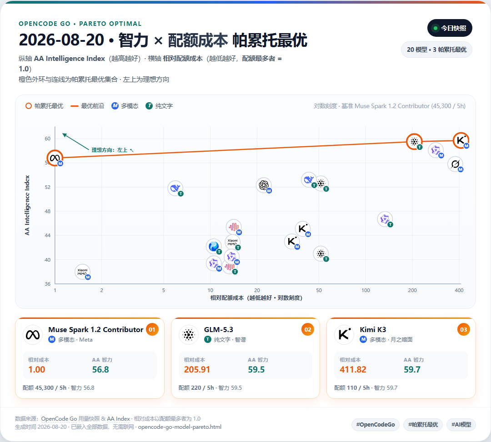

# OpenCode Go 模型帕累托图

> 基于 OpenCode Go 配额与 AA Intelligence Index 的「智力 × 成本」帕累托最优分析。所有图表为单文件离线 HTML，配额以**配额最多者 = 1.0** 为基准，左上为理想方向。

**当前快照：2026-08-23 · 22 模型（20 可绘制）· 3 帕累托最优**
`Muse Spark 1.2 Contributor` (成本 1.00 / 智力 56.8) · `GLM-5.3` (205.9 / 59.5) · `Kimi K3` (411.8 / 59.7)



---

## 目录结构

> **根目录仅保留 `opencode-go-model-pareto.html` 成品**，其余按职责分文件夹。

```
.
├── opencode-go-model-pareto.html        # 成品主图（唯一位于根目录的文件）
├── data/
│   ├── quota-snapshots.json             # 按日期的配额快照
│   └── aa-scores.json                   # AA 智力评分
├── template/
│   └── opencode-go-model-pareto.template.html  # 主图模板（含图标与布局）
├── scripts/
│   ├── fetch_data.py                    # 抓取官方数据并校验生成
│   ├── generate_html.py                 # 渲染主图 HTML
│   └── generate_card.py                 # 渲染分享卡片（直接出 PNG）
├── cards/
│   └── opencode-go-model-pareto-card-*-cropped.png  # 1080px 分享卡片（仅保留裁切版）
└── docs/README.md
```

---

## 快速开始

### 1. 自动抓取并生成（推荐）

在**项目根目录**执行：

```bash
# 抓取最新配额 + AA 评分，校验后更新 data/ 并重建主图
python scripts/fetch_data.py

# 仅生成主图（不抓取）
python scripts/generate_html.py

# 生成分享卡片（直接出图，无需中间代码）
python scripts/generate_card.py
#  → cards/opencode-go-model-pareto-card-2026-08-*-cropped.png
#  → cards/opencode-go-model-pareto-card-cropped.png (通用=最新)
```

`fetch_data.py` 会同时跑 `generate_html.py`，数据来源：

- OpenCode Go 配额：https://opencode.ai/docs/zh-cn/go/
- AA 评分：https://aihot.virxact.com/leaderboard/methodology

抓取结果写入 `data/quota-snapshots.json` 与 `data/aa-scores.json`。网络失败、页面结构变化、模型列表变化或校验失败时**不会覆盖原 JSON**。

常用参数：

```bash
python scripts/fetch_data.py --output-dir test   # 输出到 test/data/ 与 test/*.html，不覆盖正式文件
python scripts/fetch_data.py --no-generate       # 仅更新 JSON
python scripts/generate_card.py --keep-html      # 保留中间 HTML 供调试
python scripts/generate_card.py --no-image       # 仅生成 HTML
```

### 2. 手动维护

1. 在 `data/quota-snapshots.json` 新增/修改日期快照（每个模型填 `requests_per_5h` / `requests_per_week` / `requests_per_month`）
2. 在 `data/aa-scores.json` 修改对应模型的 `intelligence`
3. 运行 `python scripts/generate_html.py` 与 `python scripts/generate_card.py`

> **新增模型**时，需在 `scripts/generate_html.py` 的 `MODEL_META` 补充 `brand`（图标）与 `modality`（`多模态`/`纯文字`）。`data/quota-snapshots.json` 的**最新快照决定模型全集**，历史快照允许缺失新模型。

---

## 核心设计说明

### 配额基准：以最多者为 1.0
`相对配额成本 = 基准 / 该模型配额`。基准取**最新快照中配额最大值**（当前为 `Muse Spark 1.2 Contributor` 45300 / 5h），因此最慷慨的模型成本恒为 1.0，MiMo-V2.5 为 1.50。横轴 `xMax` 亦动态计算为 `基准 / 最小配额`（当前 411.8），保证所有点可见，避免固定 300 导致低配额模型出界。

`fetch_data.py` 与 `generate_html.py` 均按此规则动态计算，`normalization_reference` 字段仅作记录。

### 历史缺模型处理
`Muse Spark 1.2 Contributor` 为新模型，`2026-08-17` 与 `2026-08-18` 快照中**已删除**该条目。`generate_html.py` 的 `build_payload` 允许历史快照为最新全集的子集，缺失模型以 `null` 对齐，`template` 中 `buildData` 映射为 `cost: null` 并被 `plotted` 过滤不绘制。切换日期时：08-20 显示 20 点（含 Muse），08-17/08-18 显示 19 点（无 Muse）。

### 空配额与缺分容错
- **空配额**：线上配额为 `-` 的模型（如免费档 `Ox Alpha Free`）以 `null` 记录，`cost: null` 不参与基准/`xMax` 计算与帕累托判定，但在图表横轴以虚线头像作参考标记（免费档锚定最左端 "免费 · 不限"；有配额无 AA 分的模型如 `DeepSeek V4 Flash Vision Exp` 标在其成本位置 `≈11.9` 上）
- **缺失面板对称化**：`renderSummary` 将所有 `intelligence===null` 且在该日期快照中存在的模型以等宽卡片展示（头像 + 模态 + 配额/免费），不再只取首条；历史快照中缺失的模型用 `absent: true` 区分，避免在旧日期上误展示参考点
- **自动追加新模型**：`fetch_data.py` 遇到新增模型时自动以空值追加进 JSON 并打印提示（模型被移除仍报错拦截）；需在 `generate_html.py` 的 `MODEL_META` 手动补 `brand` 与 `modality`
- **图标集**：当前 11 个 `brand`—— `grok/openai/zhipu/kimi/xiaomimimo/minimax/qwen/deepseek/hunyuan/muse/ox`，`Ox` 为内联简易字母图标

### 分享卡片
- 尺寸：1080px 竖版，圆角卡片 + 顶部渐变
- 标题：**日期置于最大标题中**（如 `2026-08-20 · 智力 × 配额成本 帕累托最优`），右上角徽章仅显示状态（`今日快照` / `历史`）
- 内容：静态 SVG 图表（对数刻度）+ 最多 3 个帕累托最优卡片（按成本排序）+ 底部署出处与标签
- 已移除「一句话洞察」区块，信息更精炼
- `scripts/generate_card.py` **直接生成 `cards/*-cropped.png`**（Playwright 渲染 `#capture` 裁切），无需手写中间截图代码；默认清理中间 HTML，仅保留裁切 PNG

卡片生成逻辑与主图一致：同一基准、同一 `xMax`、同一图标集（`grok/openai/zhipu/kimi/xiaomimimo/minimax/qwen/deepseek/hunyuan/muse/ox`，Meta 品牌为 `muse`），且卡片静态 SVG 同步绘制横轴参考点（虚线头像）。

---

## 数据说明

- `quota-snapshots.json`：`snapshots[date].models[]`，每个模型三档配额；`label` 为 `今日`/`历史`
- `aa-scores.json`：`models[]` 含 `aa_model_id`（对应 AA 榜单 slug）与 `intelligence`；`Muse Spark 1.2 Contributor` 映射 `muse-spark-1-2`（56.8）
- 图表过滤：`plotted = data.filter(d=>d.intelligence!==null && d.cost!==null)`，仅完整数据参与帕累托计算与绘制

---

## 技术栈

- Python 3.13 · 纯标准库解析（`HTMLParser`） + `Playwright`（卡片截图）
- 前端：单文件 HTML，内联 SVG + Base64 图标，无外部依赖，离线可用
